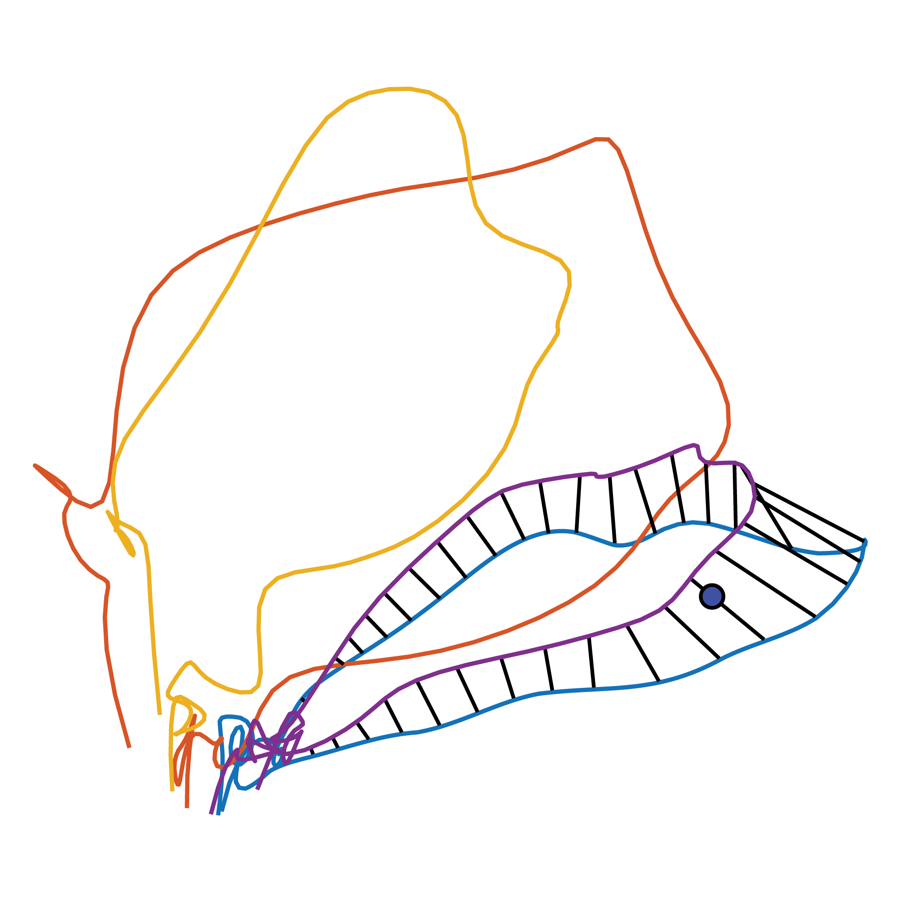

# MINT - Mesh of Idealized Neural Trajectories
This repository will be the official implementation of MINT, a neural state estimator and behavioral decode algorithm developed in the [Churchland lab](https://churchland.zuckermaninstitute.columbia.edu/). MINT leverages sparsity and stereotypy in neural activity to estimate the neural state probabilistically and read out behavior nonlinearly. The algorithm achieves high performance, yet remains computationally efficient and is straightforward to train.

    

MINT constructs a 'mesh' of states in neural state space by learning condition-specific canonical neural trajectories and using interpolation to 'fill in' the states between trajectories as needed. This approach is useful for inferring behaviorally relevant neural states and decoding behavior.

## Paper
The article describing this algorithm is currently unpublished, but will soon be submitted for publication and released online as a preprint. The authors are:
* <b>Sean M. Perkins</b> - Dept. of Biomedical Engineering, Columbia University
* <b>Karen E. Schroeder</b> - Dept. of Neuroscience, Columbia University
* <b>John P. Cunningham</b> - Dept. of Statistics, Columbia University
* <b>Qi Wang</b> - Dept. of Biomedical Engineering, Columbia University
* <b>Mark M. Churchland</b> - Dept. of Neuroscience, Columbia University

If you wish to be notified when the article is available, you may [enter your email address here](https://docs.google.com/forms/d/e/1FAIpQLSfOt2XZjSlpIotPm_N2qeFF13HIo7mTJb6FrRxrVlv4ynnTjQ/viewform?usp=sf_link). Alternatively, feel free to reach out to Sean directly:
* Email: sp3222 [at] columbia [dot] edu

## Code
The code implementing MINT (in MATLAB) is not publicly available at this time. An update on code availability will be provided soon, along with the paper. Feel free to reach out to Sean with any questions.

## Neural Latents Benchmark
MINT has been submitted as a baseline method for the the [Neural Latents Benchmark '21](https://neurallatents.github.io/) competition. The competition is designed to compare neural state estimation algorithms across seven publicly available data sets. The [leaderboard can be viewed on EvalAI](https://eval.ai/web/challenges/challenge-page/1256/leaderboard).

